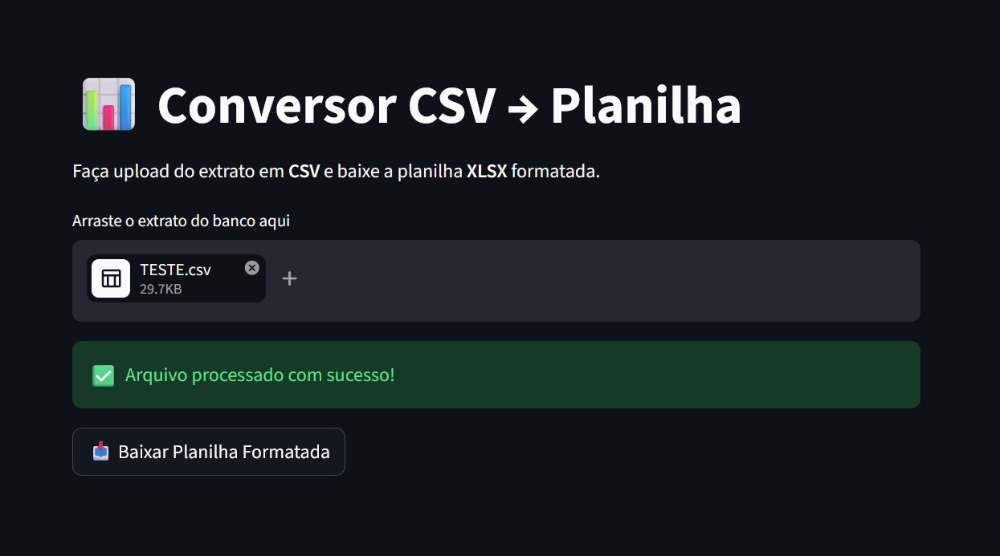

# 📊 Conversor de Extrato Bancário (CSV para XLSX)

[](https://converter-extrato.streamlit.app/)
[](https://www.python.org/)
[](https://pandas.pydata.org/)

Um micro-SaaS open-source desenvolvido para automatizar a limpeza, formatação e conversão de extratos bancários (formato CSV) para o padrão de planilhas contábeis (XLSX).

## 🚀 O Problema

A conciliação bancária manual exige formatação repetitiva: exclusão de cabeçalhos inúteis, conversão de tipagem de dados, ordenação cronológica invertida e padronização de moedas. Este projeto elimina esse trabalho manual, transformando um CSV bruto do banco (ex: Santander) em um Excel pronto para importação no sistema do cliente em segundos.

## ✨ Funcionalidades

- **Upload Drag-and-Drop:** Interface limpa e intuitiva construída com Streamlit.
- **Data Cleaning Dinâmico:** Ignora automaticamente cabeçalhos e rodapés inúteis gerados pelo sistema bancário.
- **Conversão de Tipos:** Tratamento robusto para formatos de moeda brasileiros (`1.000,00` -> `float`) e datas (`dd/mm/yyyy` -> `datetime`).
- **Ordenação Inteligente:** Inverte o padrão do extrato, colocando os dados mais recentes no topo.
- **Exportação Nativa Excel:** Utiliza a engine `xlsxwriter` para formatar a largura das colunas e aplicar máscaras de contabilidade diretamente no arquivo final, poupando o usuário de qualquer ajuste visual.

## 💻 Demonstração

Você pode testar a aplicação diretamente no navegador, sem precisar instalar nada:
👉 **[Acessar a Ferramenta Online](https://converter-extrato.streamlit.app/)**



## 🛠️ Como rodar localmente

Se você quiser clonar e rodar o projeto na sua própria máquina:

1. **Clone o repositório:**
   ```bash
   git clone [https://github.com/theunrealryan/csv2xlsx.git](https://github.com/theunrealryan/csv2xlsx.git)
   cd csv2xlsx

    Crie um ambiente virtual (Opcional, mas recomendado):
    Bash

    python -m venv venv
    source venv/bin/activate  # No Windows use: venv\Scripts\activate

    Instale as dependências:
    Bash

    pip install -r requirements.txt

    Inicie a aplicação:
    Bash

    streamlit run app.py

🏗️ Arquitetura e Tecnologias

    Frontend/Backend: Streamlit (Renderização server-side rápida).

    Processamento de Dados: Pandas (DataFrames para manipulação em memória via BytesIO, garantindo a segurança dos dados sem persistência em disco).

    Formatação de Saída: XlsxWriter (Injetado via Pandas engine para gerar o .xlsx formatado).

    Hospedagem: Streamlit Community Cloud.

📝 Licença

Este projeto é open-source e está licenciado sob a MIT License.


### O Toque Final:
Para a imagem aparecer certinho no GitHub, crie uma pasta chamada `assets` no seu